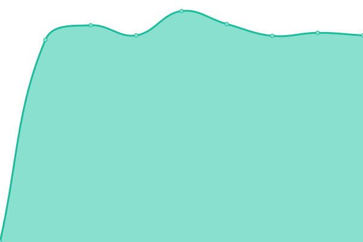
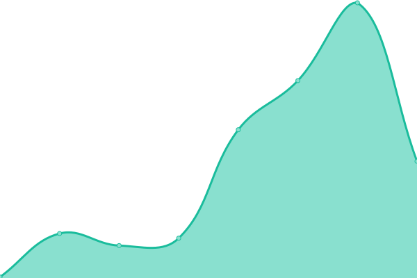
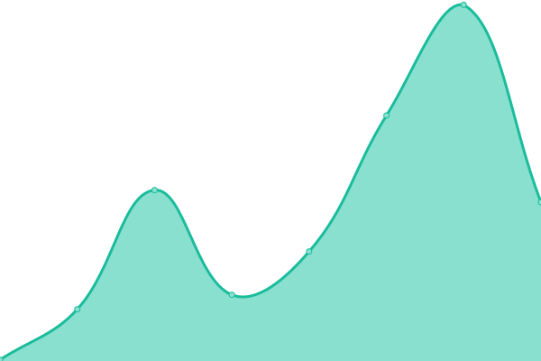
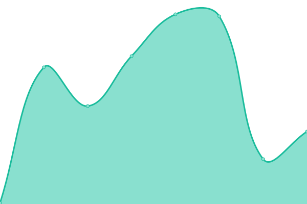
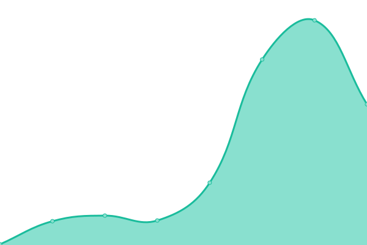
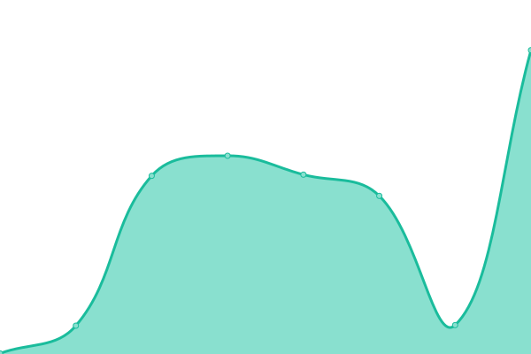

# [📈 Live Status](https://demo.upptime.js.org): <!--live status--> **🟧 Partial outage**

This repository contains the open-source uptime monitor and status page for [Gabriel Andres](https://gabrandalisse.vercel.app/), powered by [Upptime](https://github.com/upptime/upptime).

With [Upptime](https://upptime.js.org), you can get your own unlimited and free uptime monitor and status page, powered entirely by a GitHub repository. We use [Issues](https://github.com/gabrandalisse/upptime/issues) as incident reports, [Actions](https://github.com/gabrandalisse/upptime/actions) as uptime monitors, and [Pages](https://demo.upptime.js.org) for the status page.

<!--start: status pages-->
<!-- This summary is generated by Upptime (https://github.com/upptime/upptime) -->
<!-- Do not edit this manually, your changes will be overwritten -->
<!-- prettier-ignore -->
| URL | Status | History | Response Time | Uptime |
| --- | ------ | ------- | ------------- | ------ |
|  [FE Portfolio](https://gabrandalisse.vercel.app/) | 🟩 Up | [fe-portfolio.yml](https://github.com/gabrandalisse/upptime/commits/HEAD/history/fe-portfolio.yml) | 

 1544ms
     
 | 

<a href="https://gabrandalisse.github.io/upptime/history/fe-portfolio">99.80%</a>
    

|  [FE Gatsby Hotel](https://hotel-gatsby-react.netlify.app/) | 🟩 Up | [fe-gatsby-hotel.yml](https://github.com/gabrandalisse/upptime/commits/HEAD/history/fe-gatsby-hotel.yml) | 

 530ms
     
 | 

<a href="https://gabrandalisse.github.io/upptime/history/fe-gatsby-hotel">100.00%</a>
    

|  [FE MERNTasks](https://merntasks-evo.netlify.app/) | 🟩 Up | [fe-mern-tasks.yml](https://github.com/gabrandalisse/upptime/commits/HEAD/history/fe-mern-tasks.yml) | 

 449ms
     
 | 

<a href="https://gabrandalisse.github.io/upptime/history/fe-mern-tasks">100.00%</a>
    

|  [FE Product Hunt Clone](https://product-hunt-clone-9e94f.web.app/) | 🟩 Up | [fe-product-hunt-clone.yml](https://github.com/gabrandalisse/upptime/commits/HEAD/history/fe-product-hunt-clone.yml) | 

 166ms
     
 | 

<a href="https://gabrandalisse.github.io/upptime/history/fe-product-hunt-clone">100.00%</a>
    

|  [FE J&L Service](https://singular-pasca-0b330e.netlify.app/) | 🟩 Up | [fe-j-and-l-service.yml](https://github.com/gabrandalisse/upptime/commits/HEAD/history/fe-j-and-l-service.yml) | 

 429ms
     
 | 

<a href="https://gabrandalisse.github.io/upptime/history/fe-j-and-l-service">100.00%</a>
    

|  [BE MERNTasks](https://merntasks-server-evo.herokuapp.com/api/utils/health-check) | 🟥 Down | [be-mern-tasks.yml](https://github.com/gabrandalisse/upptime/commits/HEAD/history/be-mern-tasks.yml) | 

 344ms
     
 | 

<a href="https://gabrandalisse.github.io/upptime/history/be-mern-tasks">0.00%</a>
    

<!--end: status pages-->

[**Visit our status website →**](https://demo.upptime.js.org)

## 📄 License

- Powered by: [Upptime](https://github.com/upptime/upptime)
- Code: [MIT](./LICENSE) © [Gabriel Andres](https://gabrandalisse.vercel.app/)
- Data in the `./history` directory: [Open Database License](https://opendatacommons.org/licenses/odbl/1-0/)
